# RaaS (Ritual-as-a-Service) Hybrid Monetization Flow

## Overview

The Ritual-as-a-Service (RaaS) model represents a revolutionary approach to software monetization that combines the accessibility of Software-as-a-Service (SaaS) with the power of symbolic APIs and community-driven value creation. This hybrid model creates multiple revenue streams while delivering transformative experiences that go beyond traditional tool usage.

## Hybrid Monetization Logic Flow

```mermaid
graph TB
    %% User Entry Points
    User[👤 User] 
    Developer[🔧 Developer]
    Community[👥 Community]

    %% Core Interfaces
    RitualInterface[🎭 Ritual Interface<br/>SaaS Layer]
    SymbolicAPI[⚡ Symbolic API<br/>Developer Layer]
    CommunityPlatform[🤝 Community Platform<br/>Social Layer]

    %% Processing Engines
    MAG[🧠 MAG<br/>Methodology Application Gateway]
    SPDM[📊 SPDM<br/>Symbolic Pattern Data Management]
    
    %% Output Generation
    BundledResults[📦 Bundled Results]
    
    %% Specific Outputs
    Storybooks[📚 Storybooks]
    Decks[📽️ Presentation Decks]
    NFTs[🎨 NFTs]
    Protocols[⚙️ Executable Protocols]
    
    %% Value Systems
    RitualCredits[💎 Ritual Credits]
    Revenue[💰 Revenue Streams]
    
    %% Methodology Modules
    MM_APM[MM-APM<br/>Agile Project Management]
    MM_SRT[MM-SRT<br/>Symbolic Reasoning Tools]
    MM_NFE[MM-NFE<br/>NFT Framework Engineering]
    MM_RAAS[MM-RAAS<br/>Ritual-as-a-Service]

    %% User Flow
    User --> RitualInterface
    RitualInterface --> MAG
    RitualInterface --> SPDM
    
    %% Developer Flow
    Developer --> SymbolicAPI
    SymbolicAPI --> MAG
    SymbolicAPI --> SPDM
    
    %% Community Flow
    Community --> CommunityPlatform
    CommunityPlatform --> MAG
    CommunityPlatform --> RitualInterface
    
    %% Processing Flow
    MAG --> MM_APM
    MAG --> MM_SRT
    MAG --> MM_NFE
    MAG --> MM_RAAS
    
    SPDM --> BundledResults
    MAG --> BundledResults
    
    %% Output Distribution
    BundledResults --> Storybooks
    BundledResults --> Decks
    BundledResults --> NFTs
    BundledResults --> Protocols
    
    %% Value Creation
    BundledResults --> RitualCredits
    RitualCredits --> Revenue
    SymbolicAPI --> Revenue
    RitualInterface --> Revenue
    CommunityPlatform --> Revenue

    %% Styling
    classDef userClass fill:#e1f5fe,stroke:#01579b,stroke-width:2px
    classDef interfaceClass fill:#f3e5f5,stroke:#4a148c,stroke-width:2px
    classDef engineClass fill:#e8f5e8,stroke:#1b5e20,stroke-width:2px
    classDef outputClass fill:#fff3e0,stroke:#e65100,stroke-width:2px
    classDef valueClass fill:#fce4ec,stroke:#880e4f,stroke-width:2px
    classDef mmClass fill:#f1f8e9,stroke:#33691e,stroke-width:2px

    class User,Developer,Community userClass
    class RitualInterface,SymbolicAPI,CommunityPlatform interfaceClass
    class MAG,SPDM engineClass
    class BundledResults,Storybooks,Decks,NFTs,Protocols outputClass
    class RitualCredits,Revenue valueClass
    class MM_APM,MM_SRT,MM_NFE,MM_RAAS mmClass
```

## Functional Paths & Integration Points

### 1. User → Ritual Interface (SaaS Layer)
- **Entry Point**: Web application with symbolic interface design
- **Experience**: Guided ritual workflows for personal/professional transformation
- **Monetization**: Monthly/annual subscriptions ($49-$199/month)
- **Value**: Accessible, meaningful experiences without technical complexity

### 2. Developer → Symbolic API (Technical Layer)
- **Entry Point**: RESTful APIs with symbolic operation endpoints
- **Experience**: Programmatic access to methodology engines (MAG, SPDM)
- **Monetization**: Usage-based billing ($0.10-$1.00 per API call)
- **Value**: Integration capabilities for building symbolic-powered applications

### 3. Community → Platform (Social Layer)
- **Entry Point**: Collaborative spaces for shared ritual experiences
- **Experience**: Team rituals, template sharing, peer learning
- **Monetization**: Enterprise licensing, marketplace commissions
- **Value**: Amplified impact through collective symbolic work

## Output Bundling Strategy

### Storybooks
- **Format**: Interactive narrative documents
- **Use Cases**: Onboarding, training, documentation
- **Integration**: MM-SRT (Symbolic Reasoning Tools) for narrative generation
- **Revenue**: Premium content licensing, custom story creation

### Presentation Decks
- **Format**: Dynamic, data-driven slide presentations
- **Use Cases**: Business pitches, strategy sessions, progress reports
- **Integration**: MM-APM (Agile Project Management) for structured content
- **Revenue**: Template marketplace, custom deck generation services

### NFTs
- **Format**: Blockchain-verified digital certificates
- **Use Cases**: Achievement tracking, credential verification, collectibles
- **Integration**: MM-NFE (NFT Framework Engineering) for minting and management
- **Revenue**: Minting fees, marketplace transactions, premium features

### Executable Protocols
- **Format**: Codified methodology workflows
- **Use Cases**: Process automation, team coordination, compliance tracking
- **Integration**: All MMs for protocol generation and execution
- **Revenue**: Protocol licensing, custom development, enterprise deployment

## Methodology Module Cross-Integration

The RaaS model is enhanced by strategic integration with core methodology modules:

- **MM-APM**: Provides structured project management frameworks that generate actionable protocols and progress tracking systems
- **MM-SRT**: Powers symbolic reasoning capabilities that transform abstract concepts into concrete deliverables
- **MM-NFE**: Enables blockchain-based verification and monetization of ritual outcomes through NFT creation

## Revenue Model Summary

| Stream | Target | Pricing | Volume Potential |
|--------|--------|---------|------------------|
| SaaS Subscriptions | Individual Users | $49-199/month | 10K+ subscribers |
| API Usage | Developers | $0.10-1.00/call | 1M+ calls/month |
| Premium Outputs | Power Users | $15-100/item | 50K+ items/month |
| Enterprise Licensing | Organizations | $500-5K/month | 100+ enterprises |
| Marketplace | Community | 10-30% commission | $100K+ GMV/month |

## Implementation Roadmap

1. **Phase 1**: Core SaaS interface with basic ritual templates
2. **Phase 2**: Symbolic API launch with MAG/SPDM integration
3. **Phase 3**: Community platform and template marketplace
4. **Phase 4**: Advanced bundling with NFT and protocol generation
5. **Phase 5**: Enterprise features and custom methodology development

The RaaS model transforms traditional software delivery into experiential value creation, establishing sustainable revenue streams while building a community around meaningful symbolic work.